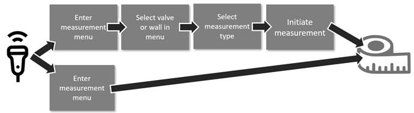

## Article

A link to the article will be available once published. 

## Supplementary Material

### Appendix A: Measurement Type Descriptions

A detailed description of all the Doppler measurement types referenced in the article is provided below. For full 
information on the relevant measurements as well as the referenced echocardiography (echo) views the reader is referred 
to the America Society of Echocardiography guidelines [1]. 

**Aortic Valve (AV)**: The aortic valve can be measured from either Apical 5 Chamber (A5C) or Apical Long Axis (APLAX). 
There are several measurements in the aortic valve region:

- **Aortic Regurgitation (AR):**  A measure of the severity of the regurgitant flow across the aortic valve measured in 
Continuous Wave (CW) Doppler. The regurgitant flow is in the positive part of the spectrum, so the baseline is typically shifted down. 
- **Aortic Valve Outflow (AVO):**  A measure of the outflow through the aortic valve measured with CW Doppler.  The 
outflow is in the negative part of the spectrum, so the baseline is typically shifted up. 
- **AR / AVO (ARAVO):** If the baseline is unchanged then either AR or AVO can be measured in the image.
- **Left Ventricle Outflow Tract (LVOT):** A measure of the velocity of blood flow through the LVOT measured with 
Pulsed Wave (PW) Doppler. This can be combined with a 2D measurement of LVOT area to give the cardiac output, a common 
measure of left heart function.

**Mitral Valve (MV):** The mitral valve can be measured from either Apical 2 Chamber (A2C), Apical 4 Chamber (A4C) view, 
or APLAX. There are several measurements in the mitral valve region:
- **Mitral Regurgitation (MR):** A measure of the severity of the regurgitant flow across the mitral valve measured 
with CW Doppler. Blood flow is in the opposite direction as the aortic valve so regurgitant flow is in the negative part 
of the spectrum (baseline shifted up).
- **Mitral Valve Trace (MVT):** A measure of the inflow through the mitral valve with CW Doppler, called trace because 
the measurement consists of tracing the outline of the blood flow. The blood flow is in the positive part of the spectrum 
(baseline shifted down). 
- **MR / MVT (MRMVT):** If the baseline is unchanged then either MR or MVT can be measured in the image. 
- **Mitral Valve E/A (MVEA):** A measure of left ventricle function given by the ratio of peak velocity of blood flow 
across the mitral valve during the early diastole phase of the heart cycle (E wave) to the peak velocity during the 
atrial contraction (A wave). The E/A ratio is measured with PW Doppler.

**Pulmonary Valve (PV):** The pulmonary valve can be measured from the Parasternal Short Axis (PSAX) view. There are 
several measurements taken in the pulmonary valve region:
- **Pulmonary Regurgitation (PR):** A measure of the severity of the regurgitant flow across the pulmonary valve 
measured with CW Doppler. Like the aortic valve measurements, the regurgitant flow is in the positive part of the 
spectrum so the baseline is shifted down. 
- **Pulmonary Valve Outflow (PVO):** A measure of the outflow through the pulmonary valve measured with CW Doppler. 
The outflow is in the negative part of the spectrum, so the baseline is typically shifted up. 
- **PR / PVO (PRPVO):** If the baseline is unchanged then either PR or PVO can be measured in the image. 
- **Right Ventricle Outflow Tract (RVOT):** A measure of the velocity of blood flow through the RVOT measured with PW 
Doppler. Like LVOT measurements, this can be combined with 2D measurements of RVOT area to give a metric for right heart function.

**Tricuspid Valve (TV):** The tricuspid valve can be measured from A4C, PSAX, or Right Ventricle Outflow view which is 
similar to Parasternal Long Axis (PLAX). There are several measurements taken in the tricuspid valve region:
- **Tricuspid Regurgitation (TR):** A measure of the severity of the regurgitant flow across the tricuspid valve 
measured with CW Doppler. The regurgitant flow is typically in the positive part of the spectrum so the baseline is 
shifted down. However, since this is the only CW measurement for this valve class, the baseline is not considered in our approach. 
- **Tricuspid Valve Inflow (TVEA):** Like MVEA, but for the right side of the heart. TVEA is a measure of the ratio 
between peak velocity at the early diastole phase (E wave) to peak velocity during the atrial contraction (A wave) 
measured with PW Doppler. 

**Pulmonary Vein (PVe):** The pulmonary vein can be measured from the A4C view and PW Doppler is used to measure 
pulmonary venous blood flow velocities.

**Septal Tissue Doppler (SEP):** The motion of the basal septal wall can be measured from A4C using Tissue Velocity 
Doppler (TVD) to assess systolic and diastolic function.
**Lateral Tissue Doppler (LAT):** The motion of the basal lateral wall can be measured from A4C or A5C using TVD to 
assess systolic and diastolic function.
**Right Ventricle Tissue Doppler (RV):** The motion of the basal right ventricular wall can be measured from A4C or A5C 
using TVD to assess systolic and diastolic function.
**No Organ (NO):** A image containing no tissue information and random Doppler cursor locations (and thus random 
Doppler signals) so the network will not misclassify images where the probe has not yet been placed on the body. 

Three additional measurement classes were found: **Ascending Aorta**, **Descending Aorta**, and **Hepatic Vein**, but 
were not included in this measurement classification problem because they are used infrequently in clinical practice.

### Appendix B: Network Implementations

DenseNet, GoogLeNet, Inception-v3, MobileNet-v2, ResNet, ShuffleNet, and SqueezeNet architectures were implemented 
following the architectures available from the PyTorch [torchvision library](https://pytorch.org/docs/stable/torchvision/models.html). 
BN-Inception, DualPathNetwork, NasNet-A-Mobile, and Xception architectures were implemented following the benchmark analysis 
[GitHub repository](https://github.com/CeLuigi/models-comparison.pytorch)
available from Bianco et. al. [2]. For all networks the first convolutional layer was changed to have 2 input channels 
instead of 3. All networks were trained from scratch since preliminary experiments with pretrained networks (excluding 
the first layer since it is a different size) yielded worse results. GoogLeNet and Inception-v3 contain auxiliary paths 
that can be used to speed up training and were weighted equally in our implementation. The input images for the 
Inception-v3 network were changed to 299×299 (resized after 224×224 crop) following the constraints of that architecture. 

### Appendix C: Example Integration of Automatic Measurement Type Recognition

Below is an example of how the automatic measurement type recognition introduced in this manuscript can increase the 
efficiency of clinical workflows. Fig. C1 shows an example workflow for conducting a Doppler Spectrum measurement 
before and after including automatic measurement type recognition. The user must manually click through menus to find 
the corresponding measurement without measurement type recognition, while that step is performed automatically once the 
algorithm is implemented.

*Fig. C.1 An example measurement workflow without (above) and with (below) automatic measurement type recognition.*

### References
[1] C. Mitchell et al., “Guidelines for Performing a Comprehensive Transthoracic Echocardiographic Examination in 
Adults: Recommendations from the American Society of Echocardiography,” *J. Am. Soc. Echocardiogr.*, vol. 32, no. 1, pp. 1–64, 2019.

[2] S. Bianco, R. Cadene, L. Celona, and P. Napoletano, “Benchmark Analysis of Representative Deep Neural Network 
Architectures,” *IEEE Access*, vol. 6, 2018.

